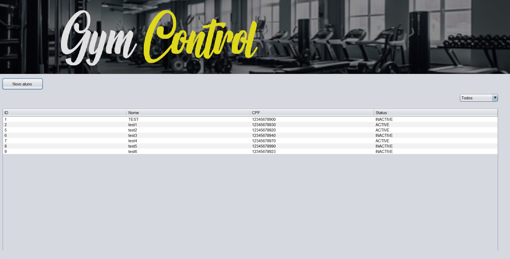

# GymControl 🏋️‍♂️

Sistema desktop de gestão para academias, desenvolvido em Java, com foco em organização de código, separação de responsabilidades e boas práticas de desenvolvimento.

O sistema permite o controle de alunos e administradores, oferecendo funcionalidades completas de cadastro, listagem, edição e ativação/desativação de registros.

---

## 🚀 Tecnologias utilizadas

- Java
- Java Swing (JFrame)
- MySQL
- JDBC
- Maven
- BCrypt (hash de senhas)

---

## 📋 Funcionalidades

### Administrador
- Login com autenticação
- Cadastro de novos administradores
- Ativação e desativação de administradores

### Alunos (Members)
- Cadastro de alunos
- Listagem em tabela
- Filtro por status (ativos / inativos)
- Edição de dados
- Ativação e desativação de alunos
- Validações de dados no service

---

## 🧱 Arquitetura do projeto

O projeto segue uma separação clara de responsabilidades:

model/ → Entidades do sistema
repository/ → Acesso ao banco de dados (JDBC)
test/ → Testes feitos sem tela
service/ → Regras de negócio e validações
view/ → Interfaces gráficas (JFrame)
util/ → Conexão com o banco de dados

---

## 🗄️ Banco de Dados

Banco utilizado: **MySQL**

Principais tabelas:
- `member`
- `admin`

Observações:
- IDs com `AUTO_INCREMENT`
- Status controlado via `ENUM`
- Senhas armazenadas com **hash (BCrypt)**

---

##📈 Próximos passos

- Melhorias visuais na interface
- Tratamento de mensagens de erro na UI
- Refatoração para uso futuro com JavaFX
- Implementação de relatórios

---

##👤 Autor

João Pedro de Oliveira | Estudante de Desenvolvimento de Sistemas
